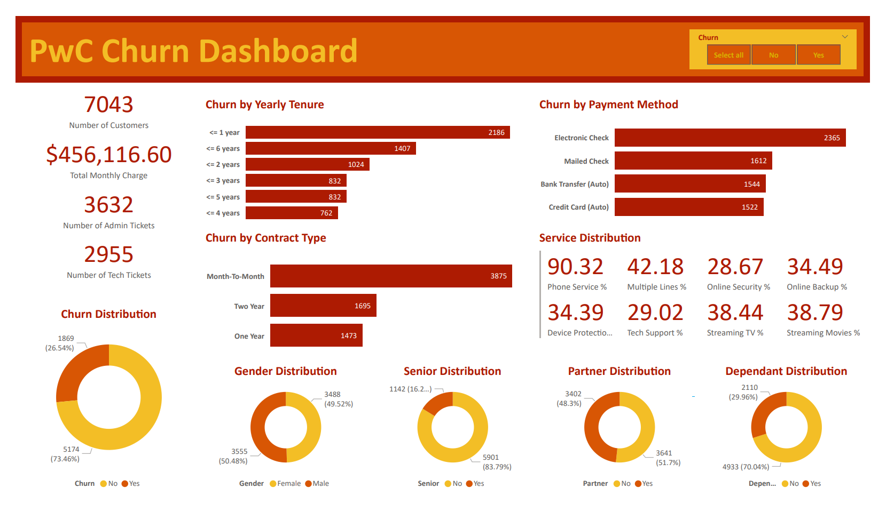
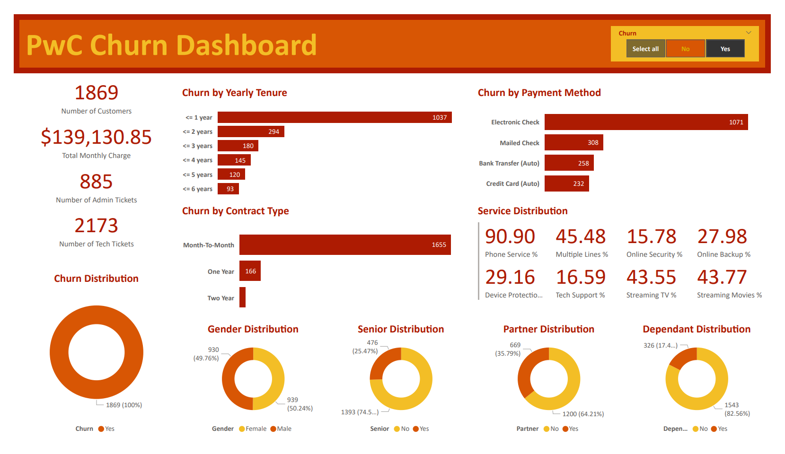

# Customer Churn Dashboard (PWC Power BI Project Part 2)

## Introduction
This dashboard is Part 2 of a project from the [PwC Power BI micro-internship](https://www.theforage.com/simulations/pwc-ch/power-bi-cqxg) hosted by Forage. Pricewaterhouse Coopers International Limited (PwC) is a multinational professional services brand of firms that specializs in auditing and tax and business consulting.

In this task, the retention manager for PhoneNow, a fictional telecom company, has tasked me to put together a dashboard about customer retention. The purpose of creating the dashboard is to help identify which customers are at risk of churn in advance.

## Problem Statement
PhoneNow's customers are hard earned and the company does not want to lose them. The retention department's goal is to convince customers who have terminated their contract to continue business with PhoneNow. However, the retention department contact customers after they have ternimated their contract. The department wants a more proactive approach by determining which customer base are at risk of churn.

## Skills Demonstrated
* Power BI
* Data Visualization
* Dashboard Creation
* Defining KPIs
* Data Transfroming (Excel)
* Data Transforming (Power BI)
* Creating Measures (Power BI)
* Creating Calculated Columns (Power BI)

## Data Sourcing
This data was provided to me by the PwC Power BI microinternship hosted by Forage. A copy of the data is included in this repository under the file name: 02 Churn-Dataset (Cleaned).xlsx.

## Data Attributes
The data is PhoneNow's customer data. It includes data on customer demographics, payment data, and the type of services they subscribed to. The date ranges from Jan. 1 2021 to Mar. 31 2021.
* customerID - A unique ID issued to each customer.
* gender - The customer's gender.
* SeniorCitizen - Whether or not the customer is a senior citizen.
* Partner - Whether or not the customer has a partner/spouse.
* Depndents - Whether or not the customer has any dependents.
* tenure - The length of time the customer has done business with PhoneNow.
* PhoneService - Whether or not the customer has a phone line with PhoneNow.
* MultipleLines - Whether or not the customer has more than 1 phone line with PhoneNow.
* InternetService - Whether or not the customer use PhoneNow as their internet provider.
* OnlineSecurity - Whether or not the customer is using PhoneNow's online security service.
* OnlineBackup - Whether or not the customer is using PhoneNow's online backup service.
* DeviceProtection - Whether or not the customer is using PhoneNow's device protection service.
* TechSupport - Whether or not the customer is subscribed to PhoneNow's tech support.
* StreamingTV - Whether or not the customer is using PhoneNow's TV streaming service.
* StreamingMovies - Whether or not the customer is using PhoneNow's movie streaming service.
* Contract - The type of payment contract the customer is using (monthly, yearly, etc.)
* PaperlessBilling - Whether or not the customer is receiving an electronic bill.
* PaymentMethod -  The method in which a customer pays their bill.
* MonthlyCharge - The monthly cost for the customer.
* TotalCharge - The total cost for the customer.
* numAdminTicket - The number of tickets a customer have submitted for administrative support.
* numTechTicket - The number of tickets a customer have submitted for tech support.
* Churn - Whether or not the customer has churned.

## Data Transformation
The data was cleaned and transformed using Excel and the Power Query Editor from Power BI. The steps used to clean and transform the data set are:

In Excel:
* The "SeniorCitizen" column is in binary (1 = yes, 0 = no). However, other columns such as "Partners" and "Dependents" are written in Yes No format. The "SeniorCitizen" column was converted into Yes No format to match with the rest of the columns.

In Power BI:
* The "tenure" column shows the number of months a customer has done business with PhoneNow. The range in the "tenure" column is 1-72. Rather than trying to plot a graph with 72 points, it is better to group the number of months into a range of years (<= 1 year, <= 2 years, etc.). Power BI cannot convert number of months into a range of years, so a calculated column must be created. A calculated column called "Yearly Tenure" is created using this DAX function:
```
Yearly Tenure = SWITCH(
                       TRUE(),
                       'Clean'[tenure]<=12,"<= 1 year",
                       'Clean'[tenure]<=24,"<= 2 years",
                       'Clean'[tenure]<=36,"<= 3 years",
                       'Clean'[tenure]<=48,"<= 4 years",
                       'Clean'[tenure]<=60,"<= 5 years",
                       'Clean'[tenure]<=72,"<= 6 years")

# The SWITCH() function evaluates an expression against a list of values and returns one of multiple possible result expressions.
# The TRUE() attribute replaces multiple IF statements.
# The remaining attributes tells the function how to group each set of values (if the number in the "tenure" column is <= 12, the value in the "Yearly Tenure" column is "<= 1 year").
```
* PhoneNow provides 8 different services which include Device Protection. To calculate the percentage of customers who subscribed to a service that PhoneNow provides, this DAX function was used:
```
Device Protection % = DIVIDE(
                             CALCULATE(COUNT('Clean'[DeviceProtection]), 'Clean'[DeviceProtection] ="Yes"),
                             COUNT('Clean'[DeviceProtection]),
                             0) * 100

# The DIVIDE() function is divided into 3 attributes.
# The first two attributes are the 2 values you want to divide (# of customers who are subscribed to the Device Protection service and the total number of customers).
# The third attribute is the number you want the function to output if a number is divided by 0.
# The COUNT() function counts the number of rows in the "DeviceProtection" column (total number of customers).
# The CALCULATE() function allows you to perform an aggregate calculation with a filter applied.
# In this example, we want the number of rows in the "DeviceProtection" column with a filter applied where the value is "Yes" (number of customers who subscribed to the Device Protection service).
```

# Data Analysis and Visuals
A copy of the below dashboards are included in this repository under the file name: James Weber PwC Churn Dashboard.pbix.

The below image is a screenshot of the Customer Churn Dashboard that includes all customers.



The below image is a screenshot of the Customer Churn Dashboard that only include customers who have churned.


* PhoneNow has a churn rate of 26.54%. An ideal percentage for churn is 5% to 7%.
* The cost of churned customers is approximately $140,000.
* 73.54% of Tech Tickets were submitted by customers who have churned. This indicates that customers who have left PhoneNow tend to experience technical difficulties.
* The likelihood of churn decreases the longer a customer stays in business with PhoneNow. Over half of customers who have churned left PhoneNow within a year.
* Nearly half of churned customers pay using electronic checks. Perhaps some of the technical issues involve difficulty in paying bills?
* 88.55% of churned customers pay their bills monthly.
* Customers who have churned have a higher tendency to use PhoneNow's streaming TV and movie services. However, they have a lower tendency to use PhoneNow's various support services such as online security, online backup, device protection, and tech support services. Customer's lack of interest in PhoneNow's support services may contribute to the tech issues that they face.
* Compared to PhoneNow's total customer base, churned customers have a higher percentage of being seniors, with no partners or dependants.

# Conclusions and Recommendations
* Based on the data, it seems that tech issues are a major factor in customers deciding to leave PhoneNow.
* To help mitigate tech issues, PhoneNow could market the benefits of their support services or bundle their support services with their phone and streaming services.
* An investigations is needed to determine if there are any issues with PhoneNow's monthly electronic payment system or if there is a way to improve the system.
* To help convince customers to stay in business with PhoneNow for a year, special deals and promotions could be offered to new customers for their first year. New customers who sign up for PhoneNow's streaming service could have free tech support for their first year.
